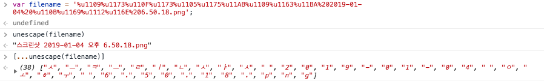
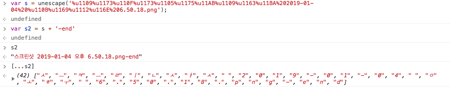
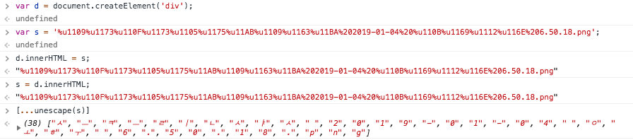
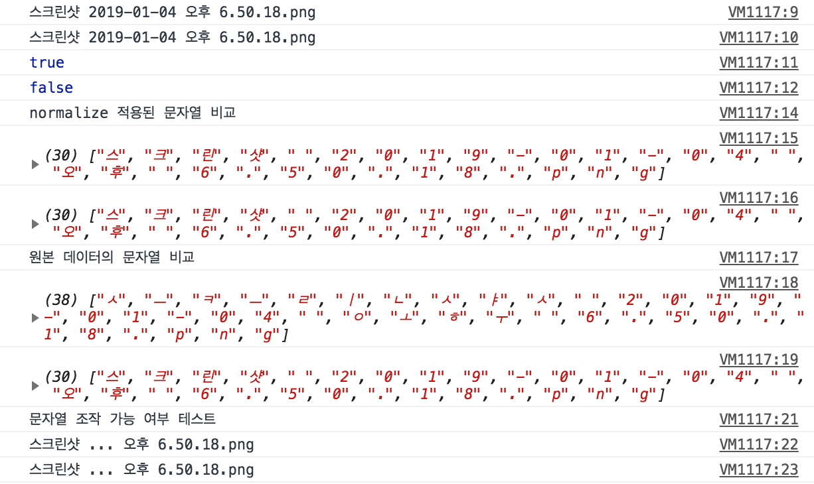

# 한글 인코딩과 자바스크립트

한글 인코딩은 과거에서부터 지금까지 항상 개발자들을 괴롭히며 풀리지 않지만 풀어야하는 숙제처럼 남아있다. 이 글은 몇 일전 우연히 전 동료 개발자로부터 제보받은 내용에 대한 탐구 과정을 기록해놓은 글이며 *Best Practice*는 아닐 것이다. 그러나 한 번쯤은 이런 고민을 해볼법한 문제라고 생각이되며 고객들과 맞닿는 최전선에서 근무하는 나를 포함한 모든 개발자들에게 언젠가 영혼을 빨아먹는 해리포터의 디멘터처럼 갑작스럽게 찾아올 수도 있다는 생각이 들었다.

사건의 발달은 이러하다. 나의 전 직장 동료 [꿀배(별명)](https://github.com/WonbaeLee)씨와 다른 동료들이 다 같이 있는 단체 메신져 방에서 일어난 일이다.
* 꿀배 : 여러분들, 이 문제 아시는 분 계십니까?
* 모두 : ?
* 꿀배 : Mac OS 환경에서, HTML에 ```<input type="file" />``` 태그를 삽입하고 파일을 업로드했어요. 파일명은 "스크린샷 2019-01-04 오후 6.50.18.png" 이고요. 그리고 이 파일명을 어딘가에 표시를 해야하는데, 이름이 너무 길어서 중간에 "..."을 ```replace```를 이용해서 치환하려고 했죠
* 모두 : 하면 되잖아요?
* 꿀배 : 저도 당연히 그렇게 해봤죠. 근데 결과가 이상해요. 문자열이 이상하게 잘려요.
* 모두 : 코드 공유좀 부탁드립니다.
* 꿀배 : 우선, 업로드 된 파일명을 가져오고 유니코드를 따져보니 이렇게 나오고요, 이거를 크롬 콘솔창에서 ```unescape```를 적용하면 이렇게 나오는데, 생김새는 똑같은데 유니코드가 달라서 생기는 문제인 것 같아요. 이거 어떻게 할까요?

   대략적인 사건의 정리는 이렇다. 파일을 업로드하고 코드로 해당 파일명을 가져온다. 가져온 파일명을 ```substr```등과 같은 메소드를 이용해 조작한다. 그런데. 작동하지 않는다. (!!!)


###### 결과적으로 만들고 싶었던 파일명의 형태

그리고 문제의 유니코드는 다음과 같다.


*filename*이 업로드한 파일의 이름을 유니코드화 한 형태이고, 그 아래는 문자열의 변환을 꾀하 모습이지만 보기좋게 실패한 것을 볼 수 있다. **왜 이런 일이 발생할까?**

# 한글의 원리와 유니코드의 역사
   위대하고 위대하신 우리의 세종대왕은 만렙의 정치력으로 집현전에서 [포괄임금제를 받고 일하는 현대](https://vignette.wikia.nocookie.net/satireknight/images/8/81/Nooooooo_otter.jpg/revision/latest?cb=20141106102839)에서도
어디서 많이 본 듯한, 당신의 부하들(?)을 시켜 역사에 길이길이 남을 자랑스러운 한글을 창제하셨다. 한글의 기본 원리는 초성, 중성, 종성을 결합해서 하나의 새로운 음절을 만드는 [조합형](https://namu.wiki/w/%EC%A1%B0%ED%95%A9%ED%98%95)이며 옛 한글에서는
천지인, 즉 하늘과 땅과 나 자신의 삼위일체를 뜻하는  ㆍ 기호를 포함했다. (참고로 이 기호는 윈도우에서 ㅌ 한자 → 5번 숫자열에 위치해있다.) 
이것이 왜 문제가 되었는지는 컴퓨터의 역사를 잠깐 돌이키면 알 수 있다. 폰 노이만은 몰라도 *애니악*은 안다고, 마치 스타크래프트는 몰라도 임요환은 아는 것처럼 우리가 사용하는 모든 컴퓨터의 베이스는 이런 *애니악*류의 것에서부터 나온 것임을 다들 알 것이다. 현재의 *computer*의 이름은 *compute*에서 왔다는 것도 어렴풋이 컴퓨터 역사시간에 배운 기억이 있다. 
그 때 당시에는 정말 산술 계산을 위해 존재했다고 전해지지만 얼마 지나지 않아 서로 간의 통신이 필요해지게 되었고 숫자 기반의 연산에서는 무리가 있었다. 해서, 자연스럽게 문자에 대한 처리의 수요가 발생했다고한다. 
<br>
<br>
<br>
   현재 [미국에 거주중인 인구](https://www.google.com/search?q=population+diversity+in+the+usa&rlz=1C5CHFA_enKR824KR824&oq=population+diversity+in+the+usa&aqs=chrome.0.69i59j0.4217j0j1&sourceid=chrome&ie=UTF-8)의 약 17.8%는 히스패닉과 라틴계이고, 백인의 비율은 61.3%라고 한다. 
이민자가 더욱이 적었을 과거의 무렵엔 특히나 아직까지도 우리에게 백인우월주의의 선입견이 남아있는 미국이란 나라에서 컴퓨터 개발을 주도한 사람들은 아마 거의 대부분이 백인으로 구성되어 있지 않을까하는 조심스러운 예측을 기반으로,
 문자 처리에 대한 표준 부호, *ASCII*, 에 대해서 아주 간략하게 알아보겠다. 구글에 ["What does ASCII stand for"](https://www.google.com/search?q=what+does+ascii+stand+for&rlz=1C5CHFA_enKR824KR824&oq=what+does+asc&aqs=chrome.0.69i59j69i57j0l4.2597j0j9&sourceid=chrome&ie=UTF-8) 라고 검색하면 *"American Standard Code for Information Interchange"*
  라고 나오는데 여기서 우리는 *"American"*에 주목할 필요가 있다. 그렇다. 세상은 치사하기때문에 먼저 찜한 사람이 임자다. 컴퓨터가 미국에서 시작했기때문에 자연스럽게 문자에 대한 기준은 영어, 좀 더 정확히는 라틴어에서 파생된 알파벳을 사용하는 그 때 당시의 모든 언어들 중에 미국에서 가장 
  많이 사용되고 있는 언어를 기준으로 한 표준 문자 부호를 우리는 [*ASCII*](https://namu.wiki/w/%EC%95%84%EC%8A%A4%ED%82%A4%20%EC%BD%94%EB%93%9C?from=ASCII)라고 부르고 있다. ASCII는 기본적으로 8비트 중 7비트를 사용해 문자들을 코드 값에 매핑시켜 놓았는데 이렇게 좁아터진 5평 남짓한 방에서 사는 듯한 느낌의 *ASCII* 코드는 결국 엄청난 사단(?)을 일으키고 만다.                                           
<br>
<br>
   유니코드에 대해 검색해보면 대부분 결과가 한중일 등 아시아권의 문자들을 표기하기 어려워서 유니코드가 탄생이 되었다고 나와있다.
이는 틀린 말은 아니다. 그러나 실제로는 알파벳을 사용하지만 다른 첨자가 붙어 새로운 문자를 사용하는 다른 언어들을 표기하는데 있어 기존의 *ASCII*로는 소장할 수 있는
문자의 수가 너무나도 한정적이었기 때문에 불편함을 많이 느꼈다고 한다. (예를들면 ñ) 때문에 이런 팔이 안으로 굽는 듯한 느낌적인 느낌으로 비슷한 언어부터
시작해 많은 나라의 문자들을 취합해 표기하는 방법을 강구하게 되었고 한중일의 언어가 고려되기 시작한 건 더 후의 일이라는 설이 있다. 어쨌든,
그 결과 유니코드가 탄생했다고 한다. [유니코드에 대한 역사](https://namu.wiki/w/%EC%9C%A0%EB%8B%88%EC%BD%94%EB%93%9C)는 나무위키만 해도 
엄청난 수의 관련문서가 엮여있다. 자세한 내용은 이 곳에서는 다루지 않기로 한다. ~~다룰 수가 없다.~~
<br>

# 위대한 항로의 시작 - 문자열 변환
   처음으로 시도해 본 작업은 문자열 변환이다. 어째서인지 나의 머릿속 기억 어딘가에 "스트링은 문자열 작업을 실행할 때 기존 문자열을 변환하지 않고 
새롭게 문자열을 생성해 반환한다" 라는 내용이 들어있었다. 사실인지 아닌지의 여부를 떠나서, 시도해볼만 했고 시도해봤어야 했다.
<br><br>

   첫 번째로 시도해 본 작업은 '스' 글자가 'ㅅ', 'ㅡ'와 같이 쪼개진 경우를 합치고자 시도를 해보았다. 문자열에 다른 문자를 합성함으로써 새로운 문자열을 
생성해서 문자열을 세탁(?)하고자 함이었다. 결과는?



   보기좋게 실패했다. 기존 문자열에 "-end"를 붙이고 s2에 할당하면 s2에는 새로운 문자열이 생성이 되어 그 주소가 s2가 가리키는 주소에 담기고 유니코드 또한 
어찌어찌 잘 해결될 것이라 생각했지만, 실제로 [스프레드 문법](https://developer.mozilla.org/ko/docs/Web/JavaScript/Reference/Operators/Spread_syntax)을 이용해 
확인해본 결과는 참패였다.
<br><br><br>

   기존의 문자열을 이용해 새로운 문자열을 만드는 것이 원래의 유니코드의 변화에는 영향이 없다는 것을 깨닫고 두 번째 방법을 시도해보기로 한다. 
같은 개발팀의 동료 개발자분의 재미있는 웹의 간략한 역사 시간으로 돌아가보자. 한글 인코딩에 관한 문제는 현대에 갑자기 생긴것이 아니라 과거에서부터 꾸준히 개발자들의 
머리를 아프게 한 문제였는데, 한 때는 사용하지 않는 임시 *DOM Element*를 생성하고 ```innerHTML```을 이용해 텍스트를 넣었다 회수하는 식으로 인코딩을 해결했었던 시절도 
있었다고하니, 우선 시도해보았다.



결과는 실패. 이번에도 완전한 문자열을 얻는데에는 실패하고 말았다.
<br><br><br>

   이 외에도 ```new String```을 이용한 방법, ```String```을 이용한 방법, ```loadsh```의 ```join```, ```String.prototype.concat``` 등 문자열에 대한 거의 모든 메소드를 동원해 시도해 
봤지만 바꿀 수 있는건 아무것도 없었다.
<br>

# 그랜드 라인의 날씨는 오늘도 비바람과 천둥번개였다 - 쉽지는 않았던 본격적인 원인 분석
   0승 10패 이상을 기록할 무렵 즈음, 나느 시작점을 잘못 잡고 있었던게 아닐까하는 생각에 다다랐다. 대학시절, 교수님들이 항상 모든 프로그래밍 언어의 기초는 C라고 
강조하시던 말씀이 순간 머리를 스치듯이 지나간 것은 우연일까. 나는 문자열 관련된 모든 문서를 찾아보기 시작했고, 거대한 퍼즐의 일부분이 될 지도 모른다는 희망으로 
거대한 인터넷이란 바다를 항해하기 시작했다. 모든 문서는 영어 베이스로 찾았으며 기본적이 지식 베이스가 쌓이기 전까진 한글로 작성된 문서는 열어보지 않았다. 
왜냐하면 한글 문서도 결국 누군가가 원문을 읽고 번역을 한 것이기때문에, 번역기에 의존할지언정 노를 끝까지 저어보기로 결심했다.
<br><br><br>

   가장 먼저, "문자열은 무엇인가" 라는 의문에서 출발했다. 인간의 욕구 실현의 가장 마지막 단계가 자아실현이라고 했던가. 내가 누구인지를 알아내는 것이야말로 
닭과 달걀 중 어느것이 먼지일지에 조금이라도 더 현명하게 생각할 수 있을것이란 생각이 들었다. 자바스크립트와 HTML, CSS 모두는 각각의 명세를 
상세히 기록해놓은 공식문서가 존재하는데, 다음의 인용구는 [ECMA-262 표준 문서 초안](https://www.ecma-international.org/publications/files/ECMA-ST-ARCH/ECMA-262,%201st%20edition,%20June%201997.pdf)에서 
발췌한 내용이다.
<br><br><br>

> *4.3.17 String type* <br>
> *The type **String** is the set of all finite ordered sequences of zero or more **Unicode** characters.* <br>
> *"문자열 타입은 0개 혹은 그 이상의 유니코드 문자들로 이루어진 일련의 정렬된 문자들을 의미한다."

   이 문구를 읽는 순간 누군가가 망치로 내 머리를 내려치는 듯 했다. 여러가지 실험을 통해 머릿속으론 "사실 유니코드 상태로 계속 값을 가지고 있고 모든 값의 조작은 이 값을 이용해서 
하는 것이 아닐까?" 하는 의구심은 갖고 있었지만 의심이 확신으로 변하는 순간 인간은 생각보다 큰 충격에 빠지는 듯 하다. 결국에 나는 처음부터 유니코드였던 문자열을 어떻게서든지 
그 존재를 부정하고 새롭게 탄생시키려 노력하고 있었다. 단지 화면에 보여지는 눈속임에 속아.
<br><br><br>

   좋다. 그러면 문자열이 유니코드인건 알았는데, *DOM Element*의 ```innerHTML```은 이것과 과연 무슨 관련인건지 검색을 해보기 시작했고, 
이렇다할 결과를 찾을 수는 없었다. 애시당초 나는 그 시절 개발자가 아니었고 직간접적으로 경험해보지 않아 검색 키워드를 어떻게 
설정해야할지 모르는 문제도 있었ㅇ리라. 확신은 없지만 문서에는 이런 내용이 적혀있는데 아마도 이러한 이유때문에 실패한 결과를 얻은 게 아닌가하는 생각이 든다.

> *In HTML, the innerHTML DOM attribute of all HTMLElement and HTMLDocument nodes returns a serialization of the node's children 
> using the HTML syntax. On setting, it replaces the node's children with new nodes that result from parsing the given value.* <br>
> /* ... 중략 ... */ <br> 
> *On getting, the innerHTML DOM attribute must return the result of running the **HTML fragment serialization algorithm** on the node.* <br>
> *"HTMLElement와 HTMLDocument의 모든 innerHTML 속성은 해당 노드의 자식들을 HTML 구문을 이용한 특정한 정제를 거친 결과를 반환한다. 
> 입력시에는, innerHTML은 해당 노드 자식들을 주어진 값이 파싱이되어 새롭게 배정된 새로운 노드들로 치환한다."*<br>
> *"값을 반환시에는, innerHTML은 해당 노드를 HTML 단편화 알고리즘을 반드시 적용시킨 결과를 반환해야 한다."*

[HTML 공식문서에서 발췌한 innerHTML](https://www.w3.org/TR/2008/WD-html5-20080610/dom.html#innerhtml0)
<br>
<br>

> *For each child node of the node, in tree order, run the following steps:* <br>
> * *Let current node be the child node being processed.*
> * *Append the appropriate string from the following list to s:*
>   * */* ... 중략 ... */*
>   * ***If current node is a Text or CDATASection node***
>       * *If one of the ancestors of current node is a /* ... 중략 ... */ plaintext element, then append the value of current node's data DOM attribute literally.*

> * *"트리구조로 구성되어 있는 모든 노드들은 다음과 같은 절차를 수행한다."*
>   * *현재 노드가 처리 과정의 대상 컨텍스트가 되도록 한다.*
>   * *다음의 경우에 해당하는 목록에서 적절한 문자열을 s에 덧붙인다.*
>       * */* ... 중략 ... */*
>       * *현재 노드가 Text / CDATASection 노드라면*
>           * *현재 노드의 조상 노드들이 다음 중 하나라면, 현재 노드의 데이터를 있는 그대로 반환한다.*

[HTML 공식 문서에서 발췌한 html-fragment serialization algorithm](https://www.w3.org/TR/2008/WD-html5-20080610/serializing.html#html-fragment)

이 부분은 나의 의문을 조금은 해결해주었다. 이것이 맞는 과정인지는 확실하지 않지만, 내가 파악할 수 있는 최대치의 결과물이었다.
<br><br><br>

모든 원인을 상세히 분석하기엔 턱없이 부족했지만, 현재까지의 결과물을 종합해보자면 다음과 같다. 우리가 알고 있던 자바스크립트의 문자열은 사실은 각 문자마다 할당되어있는 유니코드들의 집합체이며 문자열의 변환 과정 역시 기존의 유니코드 집합의 내용을 바꾸지 않는 이상 조합형 한글이 문자형 한글로 바뀌지는 않는다는 점이다. 
추가로 *DOM Element*등과 같은 방법으로는 해결을 할 수가 없는 상황이다. 
<br><br><br>

그렇다면 지금 상황에서 할 수 있는 방법은 무엇일까?
<br>

## 거센 파도는 곧 그 후에 찾아올 고요한 평화를 의미한다 - 해결 실마리의 발견
가장 먼저 진행한 작업은 "누군가 같은 고민을 하지 않았을까?" 이다. 
아니나 다를까, 나와 같은 고민을 실천으로 옮긴 훌륭한(?) 사람들이 있었다. 
[Hangul-js](https://github.com/e-/Hangul.js)는 조합형 한글에서 완성형 한글로, 완성형 한글에서 조합형 한글로 변환해주는 라이브러리다. 
한글 문제이다보니 한국인이 만들었고 사용법 또한 한글로 작성되어 있다. 타입스크립트를 사용하는 야놀자 프로젝트의 환경에서도 적용될 수 있도록 타입스크립트도 지원하는 듯 하다. 
이 라이브러리가 채택한 방법은 바로 **노. 가. 다.** 이다. 모든 초성, 중성, 종성에 대한 경우의 수를 고려한 노력의 흔적이 보인다. 도입 시도를 해보지는 않았지만 정 방법이 없으면 이 
라이브러리를 사용해보는 것도 좋을 듯 하다.
<br><br><br>

라이브러리의 코드를 살펴보고 나는 이런 생각이 들었다. "과연 이 정도 비용을 들여야만 해결할 수 있는 문제일까". 하늘이 무너져도 솟아날 구멍은 있다고 했던가. 
모히또에서 몰디브를(?) 마시는 듯한 알 수 없는 기분으로 인터넷을 반 포기 상태로 떠돌던 즈음, 전 동료로부터 블로그 추천을 받았다. 
[네이버에서 운영하는 블로그](https://d2.naver.com/helloworld/19187)로 보이는 이 곳에는 한글 인코딩의 역사부터 시작해 자바로 한글 인코딩을 다루는 방법까지 아주 상세히 기록이 되어 있는, 사막에서 길 잃은 나 같은 방랑자들에겐 오아시스와 같은 곳이었다. 
이 블로그에는 자바스크립트에서 지원하는 [*normalize*](https://developer.mozilla.org/en-US/docs/Web/JavaScript/Reference/Global_Objects/String/normalize) 메소드를 소개하는데, 나는 뒤도 돌아보지 않고 출근하자마자 바로 테스트를 진행했다.

<br>

결과는.. 코드로 대신한다.
```javascript
/**
* 사안: 여러 가지 한글의 유니코드 표기법으로 인해 생기는 문제 해결
* 구체: 파일명을 구성하고 있는 유니코드를 normalize를 시켜 일정한 문자열로 항상 유지
*
*
* @param file{string} input:file에 업로드한 파일의 파일명. 조합형 유니코드로 구성되어 있다.
* @param copied{string} 같은 내용의 file을 완성형 유니코드로 구성한 문자열이 들어있다. 
* @param jToW{function} 조합(j) ->(To) 완성(w) 으로 변환해주는 함수
*
*
*/ 

const file = '%u1109%u1173%u110F%u1173%u1105%u1175%u11AB%u1109%u1163%u11BA%202019-01-04%20%u110B%u1169%u1112%u116E%206.50.18.png';
const copied = '%uC2A4%uD06C%uB9B0%uC0F7%202019-01-04%20%uC624%uD6C4%206.50.18.png';

const jToW = uni => unescape(uni).normalize('NFC');

const WFile = jToW(file);
const CFile = jToW(copied);
console.log(WFile); // 스크린샷 2019-01-04 오후 6.50.18.png
console.log(CFile); // 스크린샷 2019-01-04 오후 6.50.18.png
console.log(WFile === CFile); // true
console.log(unescape(file) === unescape(copied)); // false

console.log('normalize 적용된 문자열 비교');
console.log([...WFile]);
console.log([...CFile]);
console.log('원본 데이터의 문자열 비교');
console.log([...unescape(file)]);
console.log([...unescape(copied)]);

console.log('문자열 조작 가능 여부 테스트');
console.log(WFile.replace(/[0-9]+-[0-9]+-[0-9]+/g, '...'));
console.log(CFile.replace(/[0-9]+-[0-9]+-[0-9]+/g, '...'));
```



대성공이다! 영화에서 유레카를 외치는 여주인공 옆에 항상 남주 혹은 서브남주가 무슨 전생에 나라라도 구했는지 여주의 흘러넘치는 감격을 이기지 못한 키스를 얻어 당하는(?) 장면이 조금은 이해가 되었다.
<br>

## 난파된 해적선안에 잠자고 있는 것은 황금뿐만은 아니다 - 생각지도 못했던 변수와 추후 고려 사항
기쁨도 잠시, 해당 방법에 대해 좀 더 명확하게 하려면 마무리까지 확실하게 해야했다. 우선, normalize 메소드의 경우 아주 치명적인 단점이 있었으니 그것은 바로 IE의 지원이 전혀 되지 않는 다는 것이다. 전.혀.


출처 - [구글 이미지 [WHAT THE HECK?]](http://www.quickmeme.com/img/02/0213043c2680cd6a7dad73df5359c75ce089262b3b86476a62e6564f54c40c08.jpg)

그렇다. *normalize*는 ES6 에디션부터 적용되기 시작했으며 **브라우저 호환성 테이블에 IE는 완전히 X로 표시되어 있다.** 
(하위 버젼 호환도 아닌 그냥 X) 엎친 데 덮친 격이라고, *unescape*와 *escape* 역시 스펙 표준에서는 제외되었다는 소식이다.
<br><br>

여기서 우리는 생각을 해야한다. IE의 경우 깔끔하게 무시하고 나머지 브라우저 모두를 편안하게 대응할 것인지, 험난할 길을 택할 것인지를... 혹은 구현 스펙의 요구사항 자체를 변경하는 방법도 있겠다. 
이런 예상치 못했던 사실들을 알게되고나니 다시 한 번 [Hangul-js](https://github.com/e-/Hangul.js)의 내부 코드가 왜 수 많은 조건문으로 이뤄져있는지 알 것 같았다. 
그렇다. 그 들이 걸어간 길은 내가 지금 밟고 있는 이 길인 것이었다. 그러나 해당 라이브러리 페이지를 들어가보면 수요가 많지는 않아서 업데이트가 잦지는 않지만, 
틈틈이 고민의 끈을 놓지 않은 흔적을 볼 수 있다.  우선 네이버에서 운영하는 블로그에는 자바로 한글 인코딩을 다루는 방법이 소개되어 있다. 자바스크립트가 자바의 많은 것에 영향을 받은 것은 사실이다. 
아마도 *normalize* 역시 그 중 하나가 아닐까 하는 생각이 든다.
<br>

# 긴 여정의 끝 - 돌아보며
사실 단체 채팅방에서 누군가 한 사람이 하소연 식으로 던진 의문에 몇일이나 매달리며 이렇게까지 몰두할지는 생각지도 못했다. 
의문의 꼬리를 물고 들어가다보니 바다 밑에 가라앉은 거대한 난파선이 보였고 그 안에 들어가서 실체를 확인해보니 이상향만 존재하는 것은 아니었다. 
유니코드가 한글 인코딩 문제의 거의 대부분을 해결해줬다고는 하지만 여전히, '\u1109'과 '\u3145'는 같은 'ㅅ' 을 출력한다. 한글 합성 자모와 완성형, 
첫가끝 등 복잡한 한글 인코딩의 문제는 아직 완벽하게 해결된 것은 아닌 것으로 보인다. 그 반증으로 유니코드에 수 많은 중복된 한글 문자들이 혼재하고 있다.
<br><br>

그러나, 이번 여정은 잃은 것보다 득이 더 많았다고 할 수 있을 것 같다. 개발자로써 언젠가 나도 이런 비슷한 문제에 직면하지 않으리라는 보장을 나 스스로도 할 수 없는 상황이었고 무엇보다 
콘솔창에서 보여지는 결과로만 역추측을 해서 억지로 이해해야하는 사실이 마음에 들지 않았다. 물론 지금도 정확한 내부 코드를 분석하지 않은 상태에서 문서 몇 장을 읽은 상태에서의 추측이긴 하지만 마음은 좀 더 편하다. 
앞으로 비슷한 문제를 마주하게 된다면 이번에 얻은 경험을 바탕으로 조금은 더 다양한 방법으로 고민해 볼 수 있을 듯하다.
<br><br>

마지막으로, 이 글은 한글 인코딩에 대해 확실한 해결책을 제시하지 않고 있다. 테스트 케이스도 전혀 만들어보지 않았고 만들기도 힘들었다. 완성형에 해당하는 유니코드, 조합형에 해당하는 초성, 중성, 종성의 유니코드 모두를 취합해야지만 
1개의 테스트 케이스를 만들 수 있으니 테스트 케이스 제작 비용이 너무 많이 들었기 때문에, 간단하게 내가 최초에 확인하고 싶었던 예제 한 가지만 확인하고 마무리를 지었다. 또한 브라우저 호환성 문제를 절대 간과할 수는 없다. 
이미 이 문제에 대해 진지하게 다루고 있는 오픈 소스 라이브러리가 존재하지만 이도 완벽한 것은 아니니 결국에는 문제에 직면했을 때 어떻게 유연하게 대처하는가에 달렸다.
